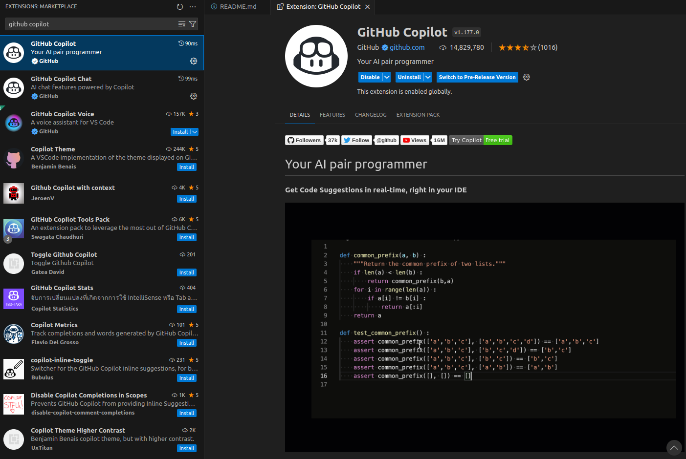
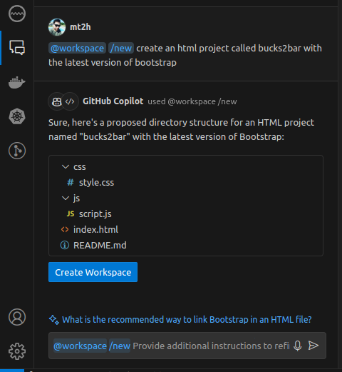
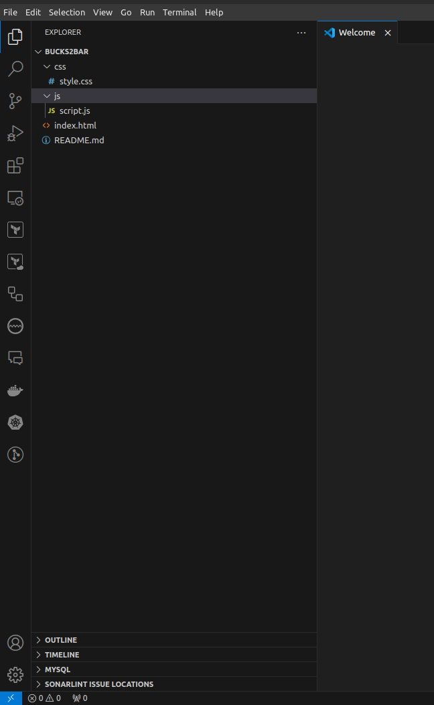

# Github Copilot





## Commands

```bash
@workspace /new create an html project called bucks2bar with the latest version of bootstrap

@workspace add https://cdn.jsdelivr.net/npm/bootstrap@5.3.3/dist/css/bootstrap.min.css and https://cdn.jsdelivr.net/npm/bootstrap@5.3.3/dist/js/bootstrap.bundle.min.js to the project
```